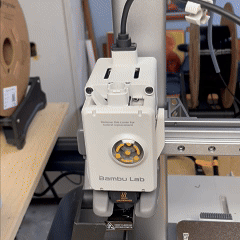
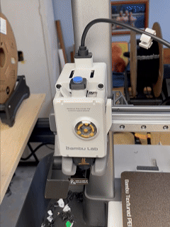

# Adapter for Bambu A1 and A1 Mini

This folder contains information for the **Bambu A1** and **A1 Mini** adapter, designed to work with the **Infinity Flow S1** filament loader. To connect the S1 to your A1/A1 Mini, you'll need adapter that links the Bowden tube from the S1 to your printer's extruder. This adapter is available for download or purchase on our website.

## Printer Compatibility
- **Bambu A1**
- **Bambu A1 Mini**

## Contents
- **A1_Adapter.stl**: Directly printable file
- **A1_Adapter.stp**: Allterable CAD file

# S1 Adapter Installation Guide

Follow these steps to print, modify, attach, and connect your S1 adapter to ensure a seamless setup.

---

## Part 1: Printing the Adapter

<table>
  <tr>
    <td width="50%">
      
    </td>
    <td width="50%">
      <li><strong>Print Settings: "0.20mm Standard @BBL A1"</strong></li>
      <ul>
        <li>Material: Generic PLA </li>
        <li>Nozzle Diameter: .4mm </li>
        <li>Print Orientation: Ensure the adapter is oriented as in picture</li>
      </ul>
      <li>After printing, inspect the adapter for any imperfections or weak spots, especially around mounting holes.</li>
    </td>
  </tr>
</table>

---

## Part 2: Hardware Modifications

<table>
  <tr>
    <td width="50%">
      
    </td>
    <td width="50%">
      <ul>
        <li><strong>Carefully</strong> remove 4 to 1 fitting</li>
      </ul>
      <li><strong>Note:</strong> To make this easier we recommend using a flat head screwdriver</li>
    </td>
  </tr>
</table>

---

## Part 3: Attaching the Adapter

### Step 1: Gather Hardware
<table>
  <tr>
    <td width="50%">
      
    </td>
    <td width="50%">
      <ul>
        <li>A1_Adapter (1x)</li>
        <li>Bowden Push Fitting (1x)</li>
      </ul>
      <li><strong>Note:</strong> To make this easier we recommend grabing a hard back book to push on</li>
    </td>
  </tr>
</table>

---

### Step 2: Adapter Assembly 
<table>
  <tr>
    <td width="50%">
      
    </td>
    <td width="50%">
      <ul>
        <li>Place adapter on table</li>
        <li>Take off black ring from the fitting</li>
        <li>Place push fitting into adapter</li>
        <li>Place blue seat on top</li>
        <li>Gently press the adapter together (book recommended)</li>
      </ul>
      <li><strong>Note:</strong> There are 2 rings on the push fitting. Make sure only the bottom one is removed.</li>
    </td>
  </tr>
</table>

---

### Step 3: Attach Adapter
<table>
  <tr>
    <td width="50%">
      
    </td>
    <td width="50%">
      <ul>
        <li> Orient the adapter correclty (arrow in front)</li>
        <li> Press into printer opening until *click* is heard and adapter sits all the way down</li>
      </ul>
    </td>
  </tr>
</table>

---

### Step 4: Plugging in the S1
<table>
  <tr>
    <td width="50%">
      
    </td>
    <td width="50%">
      <ul>
        <li>Insert the Bowden tube into the adapter’s feed port</li>
        <li>Ensure the S1 is positioned securely and all connections are properly seated</li>
        <li>Turn on the S1 and verify that it loads as expected</li>
        <li>Begin printing :)</li>
      </ul>
      <li><strong>Note:</strong> Check all connections for a secure fit, and ensure there are no loose cables.</li>
    </td>
  </tr>
</table>

---

For other adapters, please refer to the respective model folders in the [Adapter-Models](../../) directory.