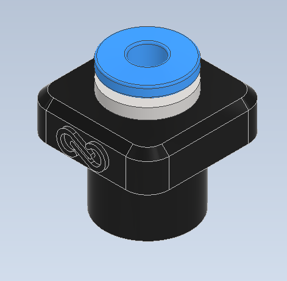

# Bambu A1 and A1 Mini Adapter

This folder contains information for the **Bambu A1** and **A1 Mini** adapter, designed to work with the **Infinity Flow S1** filament loader. To connect the S1 to your A1/A1 Mini, you'll need adapter that links the Bowden tube from the S1 to your printer's extruder. 

  

This adapter is available here for download or purchase on our [website](https://infinityflow3d.com/products/bambu-a1-a1-mini-infinity-flow-s1-adapter).

## Printer Compatibility
- **Bambu A1**
- **Bambu A1 Mini**

## Contents
- **A1_Adapter.stl**: Printable file
- **A1_Adapter.stp**: CAD file

# S1 Adapter Installation Guide

Follow these steps to print, modify, attach, and connect your S1 adapter to ensure a seamless setup.

---

## Part 1: Printing the Adapter

  <table>
    <tr>
      <td width="50%">
        
      </td>
      <td width="50%">
        
<strong>Print Settings: "0.20mm Standard @BBL A1"</strong>

        <ul>
          <li>Material: Generic PLA </li>
          <li>Nozzle Diameter: .4mm </li>
          <li>Print Orientation: Ensure the adapter is oriented as in picture</li>
        </ul>
        <li>After printing, inspect the adapter for any imperfections or weak spots, especially around mounting holes.</li>
      </td>
    </tr>
  </table>

---

## Part 2: Hardware Modifications

  <table>
    <tr>
      <td width="50%">
        
      </td>
      <td width="50%">
        <ul>
          
<strong>Carefully</strong> remove 4 to 1 fitting

        </ul>
        
<strong>Note:</strong> To make this easier we recommend using a flat head screwdriver

      </td>
    </tr>
  </table>

---

## Part 3: Attaching the Adapter

  <table>
    <tr>
      <td width="50%">
        
      </td>
      <td width="50%">
        
<h2>Step 1: Gather Hardware</h2>

        <ul>
          <li>A1_Adapter (1x)</li>
          <li>Bowden Push Fitting (1x)</li>
        </ul>
        
<strong>Note:</strong> To make this easier we recommend grabing a pair of pliers

      </td>
    </tr>
  </table>

  <table>
    <tr>
      <td width="50%">
        
      </td>
      <td width="50%">
        
<h2>Step 2: Adapter Assembly</h2>

        <ul>
          <li>Take off black ring from the fitting</li>
          <li>Place push fitting into adapter</li>
          <li>Place blue seat on top</li>
          <li>Gently press the adapter together (pliers recommended)</li>
        </ul>
        
<strong>Note:</strong> There are 2 black rings on the push fitting. Make sure only the bottom one is removed.

      </td>
    </tr>
  </table>

  <table>
    <tr>
      <td width="50%">
        
      </td>
      <td width="50%">
        
<h2>Step 3: Attach Adapter</h2>

        <ul>
          <li> Orient the adapter correctly (logo in front)</li>
          <li> Press into printer opening until *click* is heard and adapter sits all the way down</li>
        </ul>
      </td>
    </tr>
  </table>

  <table>
    <tr>
      <td width="50%">
        
      </td>
      <td width="50%">
      
<h2>Step 4: Plugging in the S1</h2>

        <ul>
          <li>Insert the Bowden tube into the adapter's feed port</li>
          <li>Ensure the S1 is positioned securely and all connections are properly seated</li>
          <li>Turn on the S1 and verify that it loads as expected</li>
          <li>Begin printing :)</li>
        </ul>
        
<strong>Note:</strong> Check all connections for a secure fit, and ensure there are no loose cables

      </td>
    </tr>
  </table>

---

For other adapters, please refer to the respective model folders in the [Adapter-Models](../../) directory.