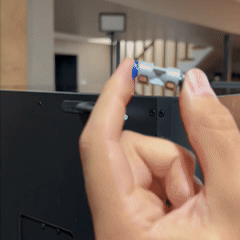
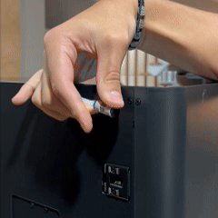

# Bambu P1S and P1P Adapter

This folder contains information for the **Bambu P1S** and **P1P** adapter, designed to work with the **Infinity Flow S1** filament loader. To connect the S1 to your P1S/P1P, you'll need the adapter that links the Bowden tube from the S1 to your printer's extruder. 

  

This adapter is available for purchase on our [website](https://infinityflow3d.com/products/bowden-coupler-adapter).

## Printer Compatibility
- **Bambu P1S**
- **Bambu P1P**

# S1 Adapter Installation Guide

Follow these steps to connect your adapter to ensure a seamless setup.

---

## Part 1: Attaching the Adapter

  <table>
    <tr>
      <td width="50%">
        
      </td>
      <td width="50%">
        <ul>
          <li>Attach adapter to printers existing bowden tube (Blue Side)</li>
        </ul>
      </td>
    </tr>
  </table>

---

## Part 2: Plugging in the S1

  <table>
    <tr>
      <td width="50%">
        
      </td>
      <td width="50%">
        <ul>
          <li>Insert the Bowden tube into the adapter's feed port (Black Side)</li>
          <li>Ensure the S1 is positioned securely and all connections are properly seated</li>
          <li>Turn on the S1 and verify that it loads as expected</li>
          <li>Begin printing :)</li>
        </ul>
        
<strong>Note:</strong> Check all connections for a secure fit, and ensure there are no loose cables

      </td>
    </tr>
  </table>

---

For other adapters, please refer to the respective model folders in the [Adapter-Models](../../) directory.