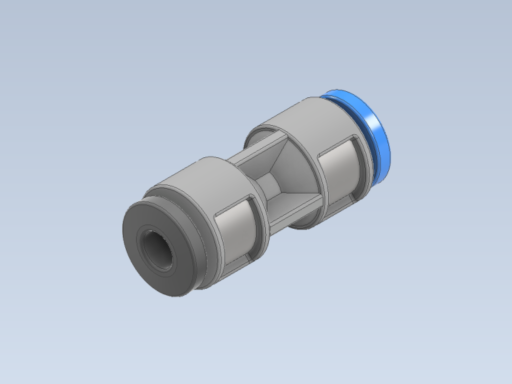
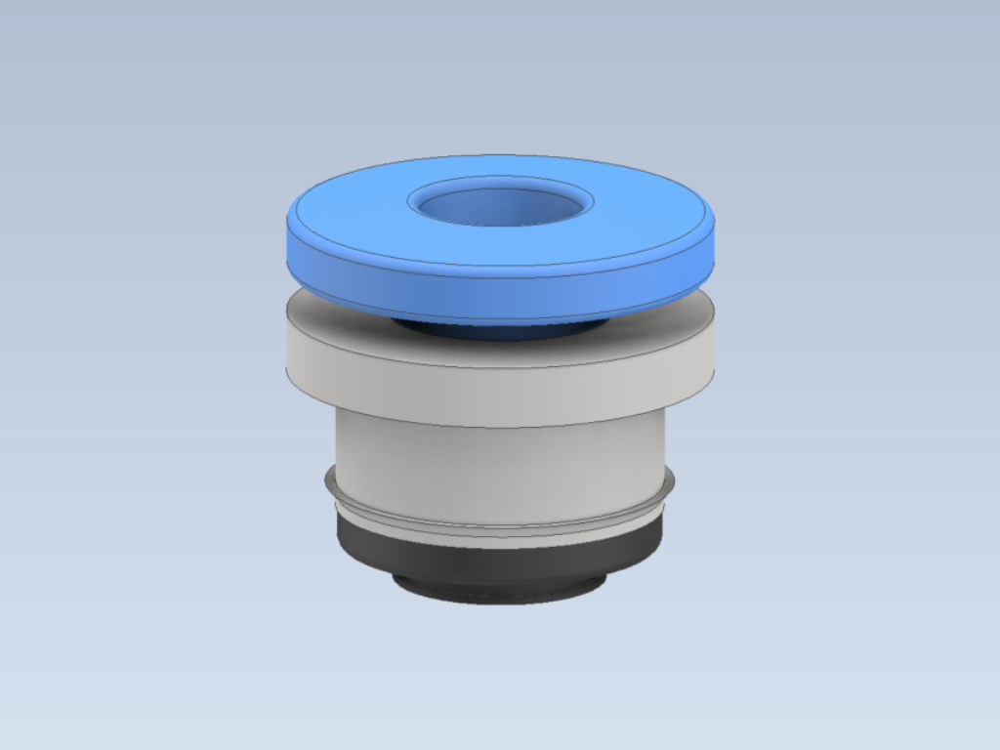

# Fittings

The `Fittings` folder contains `.stp` files for components used in the Infinity Flow S1 adapters. These files are provided for **modeling purposes**, allowing you to incorporate them into your CAD designs when creating custom adapters. By using these files, you can ensure compatibility with the S1 setup.

### Contents

- **Bowden Push Fitting (ECAS04)**: The primary push fitting used in all modeled adapters.
- **Bowden Coupler**: Used for adapters involving an existing Bowden tube.

### Usage

These `.stp` files are intended to help you model your own adapters accurately with standard fittings used in the S1 setup. You can download and import these files into your CAD software to check space, fit, and ensure reliable performance in your designs.

If you need a physical fitting, you can **purchase** them from our [website](https://infinityflow3d.com/collections/adapters).

  
  

Each image above provides a visual reference for the fittings available in this folder.
