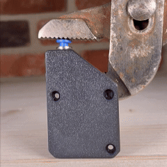

# Prusa MK4 Adapter

This folder contains information for the **Prusa MK4** adapter, designed to work with the **Infinity Flow S1** filament loader. To connect the S1 to your MK4, you'll need the adapter that links the Bowden tube from the S1 to your printer's extruder. This adapter is available for download or purchase on our website.

## Printer Compatibility
- **Prusa MK4**

## Contents
- **MK4_Adapter.stl**: Printable file
- **MK4_Adapter.stp**: CAD file

# S1 Adapter Installation Guide

Follow these steps to print, modify, attach, and connect your S1 adapter to ensure a seamless setup.

---

## Part 1: Printing the Adapter

<table>
  <tr>
    <td width="50%">
      
    </td>
    <td width="50%">
      
<strong>Print Settings: Original Prusa MK4 0.4 nozzle</strong>

      <ul>
        <li>Material: PLA</li>
        <li>Layer Height: .2mm</li>
        <li>Print Orientation: Ensure the adapter is oriented as in picture</li>
      </ul>
      
After printing, inspect the adapter for any imperfections or weak spots, especially around mounting holes.

    </td>
  </tr>
</table>

---

## Part 2: Hardware Modifications

<table>
  <tr>
    <td width="50%">
      
    </td>
    <td width="50%">
      <ul>
        <li>Remove 3 screws on front cover, "PG-case"</li>
        <li>Remove cover</li>
      </ul>
    </td>
  </tr>
</table>

---

## Part 3: Attaching the Adapter

<table>
  <tr>
    <td width="50%">
      
    </td>
    <td width="50%">
    
<h2>Step 1: Gather Hardware</h2>

      <ul>
        <li>A1_Adapter (1x)</li>
        <li>Bowden Push Fitting (1x)</li>
      </ul>
      
<strong>Note:</strong> To make this easier we recommend grabing a pair of pliers

    </td>
  </tr>
</table>

---

<table>
  <tr>
    <td width="50%">
      
    </td>
    <td width="50%">
    
<h2>Step 2: Adapter Assembly</h2>

      <ul>
        <li>Place adapter on table</li>
        <li>Take off black ring from the fitting and place in adapter</li>
        <li>Place blue seat on top</li>
        <li>Gently press the adapter together (pliers recommended)</li>
      </ul>
      
<strong>Note:</strong> There are 2 black rings on the push fitting. Make sure only the bottom one is removed.

    </td>
  </tr>
</table>

---

<table>
  <tr>
    <td width="50%">
      
    </td>
    <td width="50%">
    
<h2>Step 3: Attach Adapter</h2>

      <ul>
        <li> Orient the adapter correclty (arrow in front)</li>
        <li> Press into printer opening until *click* is heard and adapter sits all the way down</li>
      </ul>
    </td>
  </tr>
</table>

---

<table>
  <tr>
    <td width="50%">
      
    </td>
    <td width="50%">
    
<h2>Step 4: Plugging in the S1</h2>

      <ul>
        <li>Insert the Bowden tube into the adapter's feed port</li>
        <li>Ensure the S1 is positioned securely and all connections are properly seated</li>
        <li>Turn on the S1 and verify that it loads as expected</li>
        <li>Begin printing :)</li>
      </ul>
      
<strong>Note:</strong> Check all connections for a secure fit, and ensure there are no loose cables

    </td>
  </tr>
</table>

---

For other adapters, please refer to the respective model folders in the [Adapter-Models](../../) directory.