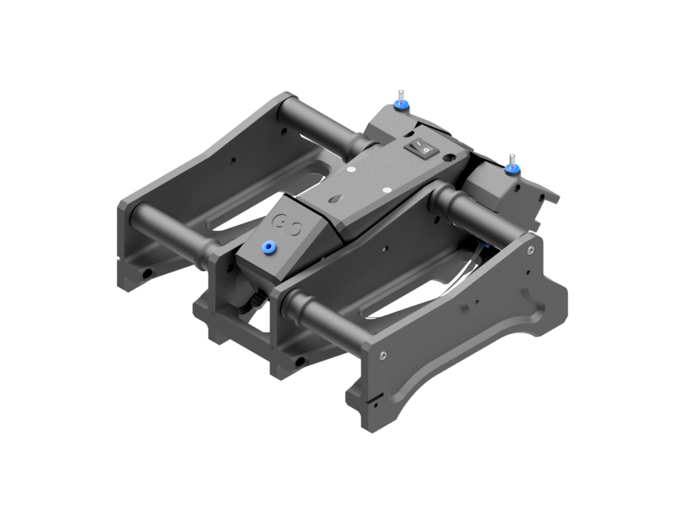

# Infinity Flow S1

Welcome to the Infinity Flow S1 repository! This repository provides all necessary CAD files and assembly instructions for integrating the Infinity Flow S1 into your 3D printing setup.

## Repository Structure

This repository is organized into two primary folders:

1. **S1-CAD/**: Contains the main assembly model of the S1 device and roller models for various filament spool sizes. Use this section to visualize the S1’s space requirements in your setup and print specific components if desired.
2. **Adapter-Models/**: Houses adapter files for connecting the S1 to various 3D printer brands. Current support includes Bambu, Prusa, and Creality models.

For specific assembly instructions and usage guidelines, refer to the README files located in each subfolder.

## Community & Support

Have questions, ideas, or an adapter design to share? Join the [Infinity Flow Community Discussions](https://github.com/yourusername/InfinityFlow-S1/discussions) to:

- **[Q&A](https://github.com/yourusername/InfinityFlow-S1/discussions/categories/q-a)**: Use this section for troubleshooting, setup help, and general questions.
- **[Show and Tell](https://github.com/yourusername/InfinityFlow-S1/discussions/categories/show-and-tell)**: Share your custom adapters, modifications, or unique setups with the community.
- **[Ideas](https://github.com/yourusername/InfinityFlow-S1/discussions/categories/ideas)**: Post suggestions for new adapters or improvements to help us enhance the Infinity Flow S1 experience.

Feel free to start a discussion or join existing threads to engage with other users and contributors.

## Collaboration and Contributions

We encourage community collaboration! If you have improvements, new adapters, or other helpful additions, please submit your design for review via a pull request:
1. **Fork the Repository**: Go to the **InfinityFlow-S1** repository and click **Fork** to create a copy in your own GitHub account.
2. **Add Your Files and README**: Add your adapter design and include a README with setup instructions.
3. **Submit a Pull Request (PR)**: Go back to the original **InfinityFlow-S1** repository, click on **Pull Requests** > **New Pull Request**, and select your forked branch to submit your changes.

We'll review your submission, and if it meets our standards, we'll add it to the main repository!

For more details, check out our [website](https://infinityflow3d.com/).
