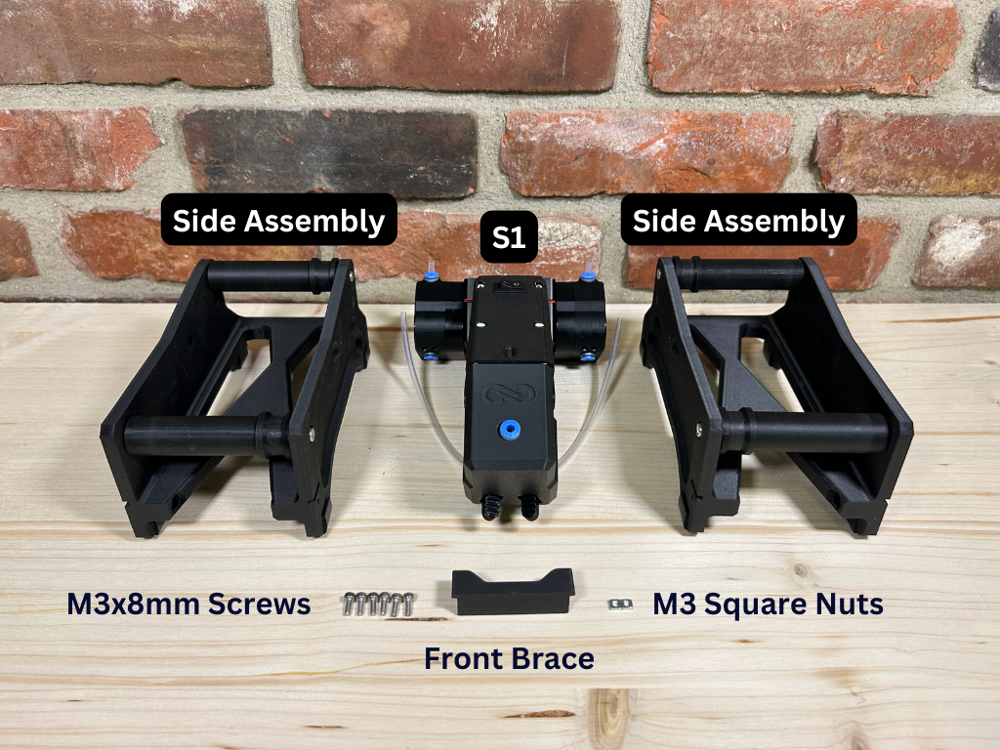

<h1 align="center" style="font-size: 100px;">S1-CAD</h1>

  

The `S1-CAD` folder provides all necessary CAD files for integrating the Infinity Flow S1 into your 3D printing setup. This includes a full assembly model to assess spatial requirements and STL files for printable roller components compatible with 1kg, 3kg, and 5kg filament spools.

## Folder Contents

### 1. S1-Main-Assembly

- **Purpose**: The `S1_Main_Assembly.stl` file is a complete model of the S1 device, allowing users to visualize the space it occupies within a 3D printing setup.
- **Usage**: Import the STL file into your preferred CAD software to plan your setup with the S1 in mind, ensuring adequate spacing for smooth operation.

### 2. S1-Sides

The `S1-Sides` section contains individual folders with STL files for rollers compatible with specific filament spool sizes(1kg, 3kg, 5kg).

For more info, please refer to our [website](https://infinityflow3d.com/).