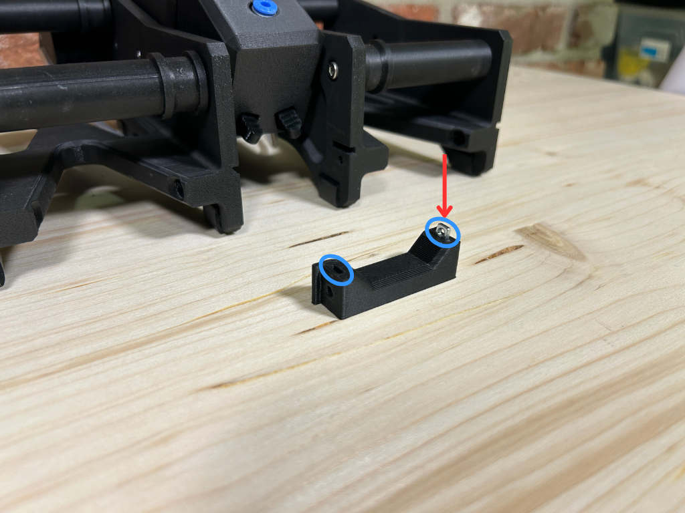
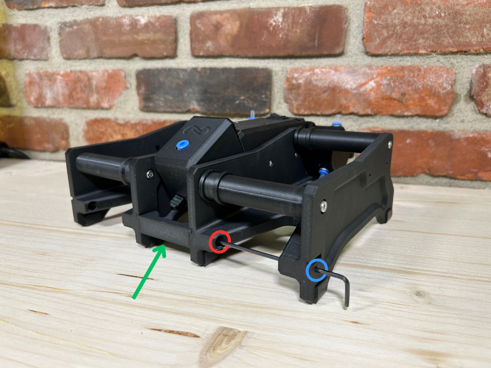

# S1 Rollers

The `S1-Rollers` folder contains STL files for printing rollers compatible with 1kg, 3kg, and 5kg filament spools. Follow the instructions below to print and assemble your rollers.

## Instructions

### Step 1: Part Preparation
<table>
  <tr>
    <td width="50%">
      
    </td>
    <td width="50%">
      
<strong>Required Tools:</strong>

      <ul>
        <li>2.5 mm Allen Key for tightening M3 screws</li>
      </ul>
      
<strong>Components:</strong>

      <ul>
        <li>Sides (2x)</li>
        <li>Bearings(624zz) (4x)</li>
        <li>Rollers (4x)</li>
        <li>Rubber Feet (8x)</li>
        <li>M4x10mm screws (8x)</li>
        <li>M4 nuts (8x)</li>
      </ul>
    </td>
  </tr>
</table>

---

### Step 2: Installing the Rollers
<table>
  <tr>
    <td width="50%">
      
    </td>
    <td width="50%">
      <ol>
        <li>Place the nuts in the hexagonal holes on the sides.</li>
        <li>Start threading the M4x10 screws from the outside to hold the nuts in place.</li>
        <li><strong>Note:</strong> Do not tighten the screws completely to allow space for the rollers.</li>
        <li>Place the roller between the nuts, align the screws with the roller holes, and tighten the screws.</li>
      </ol>
      
⚠️ <strong>Warning:</strong> Ensure the screws go into the roller to avoid damage.

    </td>
  </tr>
</table>

---

### Step 3: Installing the Second Side
<table>
  <tr>
    <td width="50%">
      
    </td>
    <td width="50%">
      <ol>
        <li>Place the nuts in the hexagonal holes on the second side and thread the M4x10 screws from the outside.</li>
        <li><strong>Note:</strong> Do not fully tighten the screws to allow roller placement.</li>
        <li>Align the rollers opposite the first side and install, ensuring they match the placement of the first rollers.</li>
      </ol>
    </td>
  </tr>
</table>

---

### Step 4: Rubber Feet Installation
<table>
  <tr>
    <td width="50%">
      
    </td>
    <td width="50%">
      <ol>
        <li>Flip the assembled sides and locate the tabs at the bottom.</li>
        <li>Remove the backing from the rubber feet and stick them firmly on the tabs.</li>
      </ol>
    </td>
  </tr>
</table>

---

### Step 5: Final Assembly
<table>
  <tr>
    <td width="50%">
      
    </td>
    <td width="50%">
      <ol>
        <li>Collect the side assemblies and remaining parts (e.g., front brace).</li>
        <li>Slide the front brace in between the two sides.</li>
        <li>Secure with M3 screws and ensure all parts are firmly in place.</li>
      </ol>
    </td>
  </tr>
</table>

---

### Step 6: Mounting Sides on the S1
<table>
  <tr>
    <td width="50%">
      
    </td>
    <td width="50%">
      <ol>
        <li>Place the side assembly against the S1 with the filament alignment slot in the roller closest to the S1.</li>
        <li>Install the 2 M3x8mm screws through the side into the S1.</li>
      </ol>
      
⚠️ <strong>Warning:</strong> Be cautious not to over-tighten the screws to prevent thread stripping.

    </td>
  </tr>
</table>

---

### Step 7: Bowden Tube Attachment
<table>
  <tr>
    <td width="50%">
      
    </td>
    <td width="50%">
      <ol>
        <li>Feed the Bowden tube under the side and through the gap.</li>
        <li>Press the Bowden tube firmly into the blue fitting.</li>
      </ol>
      
<strong>Note:</strong> Ensure the tube is seated all the way to the black line on the Bowden tube.

    </td>
  </tr>
</table>

---

### Step 8: Front Brace - Nut Installation
<table>
  <tr>
    <td width="50%">
      
    </td>
    <td width="50%">
      <ol>
        <li>Install the square nuts into the front brace.</li>
        <li>Ensure the nuts are pressed all the way into the slot.</li>
      </ol>
    </td>
  </tr>
</table>

---

### Step 9: Front Brace - Final Installation
<table>
  <tr>
    <td width="50%">
      
    </td>
    <td width="50%">
      <ol>
        <li>Slide the front brace in the slot between the two sides.</li>
        <li>Install the two M3x8mm screws and tighten them in place.</li>
      </ol>
    </td>
  </tr>
</table>

---

For further support, please refer to our [official website](https://yourwebsite.com).