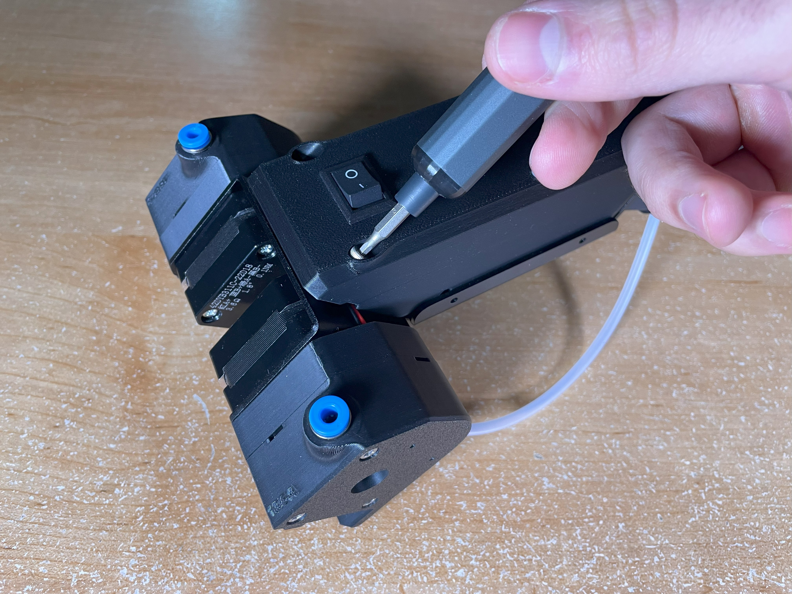

# Infinity Flow S1 Firmware Update Guide

## Overview

### Items Needed
- **USB to USB-C cable**
- **A computer**
- **The included Allen key**

Keeping your **Infinity Flow S1** up to date is essential for ensuring optimal performance.

### When to Update?
- If your **S1 is malfunctioning or experiencing issues**, a firmware update should be one of the first troubleshooting steps.
- If you have been **instructed by the Infinity Flow team** to update your firmware.

The process is straightforward: **open the S1, connect it to a computer, flash the new firmware, and reassemble the unit.**

## Step 1: Opening the S1

To access the S1’s internal components for updating the firmware, follow these steps:

1. **Remove the three screws** securing the case. *(See image below)*
2. Carefully **lift the case off**—it should come off easily.
3. You now have access to the **boot button and USB-C port**.

  
  

## Step 2: Flashing the New Firmware

1. **Enter firmware update mode**:
   - Press and hold the **boot button** *(shown in image below)*.
   - While holding the button, **plug a USB->USB-C cable** into your computer and the S1.
   - If done correctly, the **S1’s lights will turn white** instead of red.

  

2. **Access the device storage**:
   - Open **File Manager** on your computer.
   - A new drive named **"RPI-***"** will appear—this is the S1’s firmware storage.

3. **Download the latest firmware**:
   - Visit our **GitHub Firmware page** (latest version is the highest number) and in the top right corner hit the **“Download Raw File”** button.

4. **Update the firmware**:
   - Locate the **.uf2** file in your File Manager.
   - Drag and drop the downloaded firmware file into the "RPI-***" drive.
   - The **S1’s lights will turn back to red** once the update is complete.

  

## Step 3: Reassembling the S1

1. **Disconnect the USB-C cable** from the S1.
2. Carefully **place the cover back on**, ensuring that **wires fit into designated slots** *(shown in image below)*.
3. **Secure the three screws** back into place.

  
  

## Completion

Your **Infinity Flow S1 firmware update is now complete!** The S1 should now be running the latest firmware. If you continue to experience issues or notice a bug in the firmware, please **submit a Technical Support Form** for further assistance.
