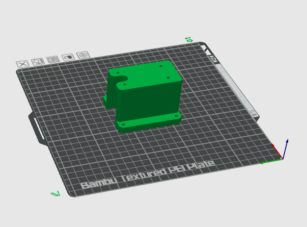

# Hang-Mount for InfinityFlow S1

This folder contains information for the **Hang-Mount**, designed for the **InfinityFlow S1** filament loader. This mount allows you to securely attach the S1 to a wall or ceiling, optimizing workspace and providing convenient filament management.

  

The Hang-Mount files are available here for download:
- **Hang_Mount.stl**: Printable file
- **Hang_Mount.stp**: CAD file for customization

## Mounting Instructions

Follow these steps to print, prepare, attach, and set up the Hang-Mount for a seamless installation.

---

## Part 1: Printing the Mount

  <table>
    <tr>
      <td width="50%">
        
      </td>
      <td width="50%">
        
<strong>Print Settings: "0.20mm Standard"</strong>

        <ul>
          <li>Material: Generic PLA</li>
          <li>Nozzle Diameter: .4mm</li>
          <li>Print Orientation: Ensure the mount is oriented as in picture</li>
        </ul>
        <li>After printing, inspect the mount for any imperfections or weak spots, especially around mounting holes.</li>
      </td>
    </tr>
  </table>

---

## Part 2: Attaching the Mount to InfinityFlow S1

  <table>
    <tr>
      <td width="50%">
        
      </td>
      <td width="50%">
        
<h2>Step 1: Prepare the S1</h2>

        <ul>
          <li>Remove the side panels of the S1 to expose the bottom mounting holes.</li>
          <li>Gather four M3 screws for attaching the mount.</li>
        </ul>
      </td>
    </tr>
  </table>

  <table>
    <tr>
      <td width="50%">
        
      </td>
      <td width="50%">
        
<h2>Step 2: Secure Mount to S1</h2>

        <ul>
          <li>Align the mount with the S1's bottom mounting holes.</li>
          <li>Insert and tighten the M3 screws to secure the mount in place.</li>
        </ul>
        
<strong>Note:</strong> Ensure all screws are firmly tightened for stability.

      </td>
    </tr>
  </table>

---

## Part 3: Mounting to Wall or Ceiling

  <table>
    <tr>
      <td width="50%">
        
      </td>
      <td width="50%">
        
<h2>Step 3: Attach to Wall or Ceiling</h2>

        <ul>
          <li>Use generic wall screws to secure the mount to your wall or ceiling.</li>
          <li>Check that the mount is secure and stable.</li>
        </ul>
      </td>
    </tr>
  </table>

---

## Part 4: Insert Filament and Begin Printing

  <table>
    <tr>
      <td width="50%">
        
      </td>
      <td width="50%">
        
<h2>Step 4: Load Filament</h2>

        <ul>
          <li>Insert the filament into the S1 loader and check for smooth feeding.</li>
          <li>Power on the S1 and start your print as usual.</li>
        </ul>
      </td>
    </tr>
  </table>

---

For other mounts and adapters, please refer to the respective model folders in the [Mounts-Models](../../) directory.
